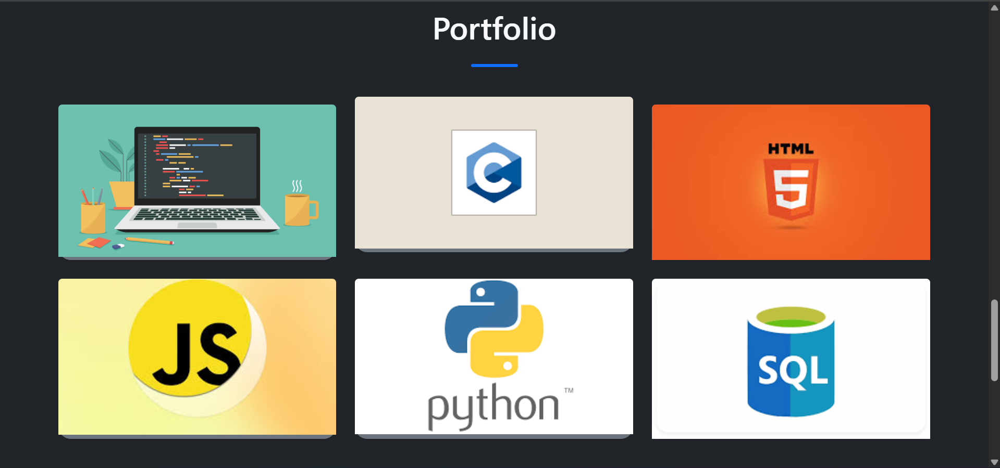
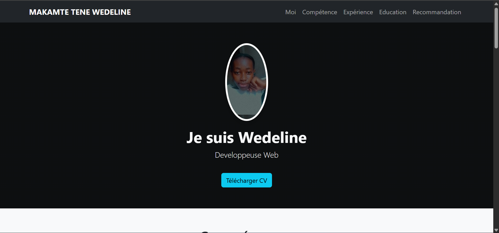
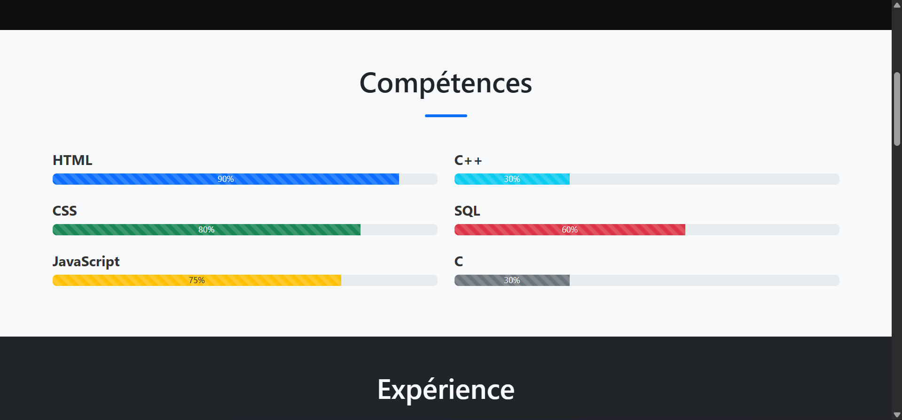
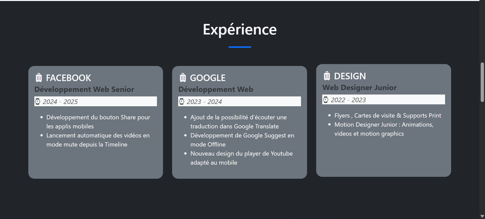

# Portfolio - Wedeline

Ce projet est un *portfolio personnel* developpe pour Wedeline.  
Il permet de presenter son profil, ses competences ainsi que ses coordonnees de contact de maniere simple et elegante.  

## Technologies utilisees
- *HTML5*;  
- *CSS3*; 
- *BootstrapCSS*.   

# Demo
Lien du site en ligne: https://aubin-pierre7.github.io/Portfolio_Wedeline/

##  Captures d'ecran:  

|  |  |  |  .
